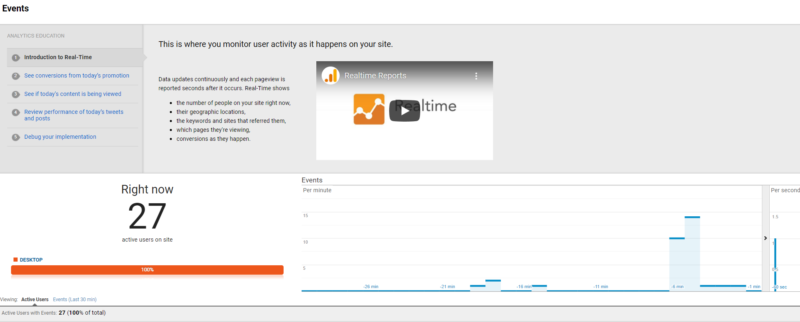

## GA Measurement Protocol live pushing

### Setup

1. Install docker

### Steps to run

1. `docker build -t gamp .`
2. `docker run -it gamp /bin/bash -c ./run.sh` 
3. Events with uah/usd rate multiplied by 1000 will be pushed into account with tracking id UA-212467075-1 every 30 seconds

### Result
